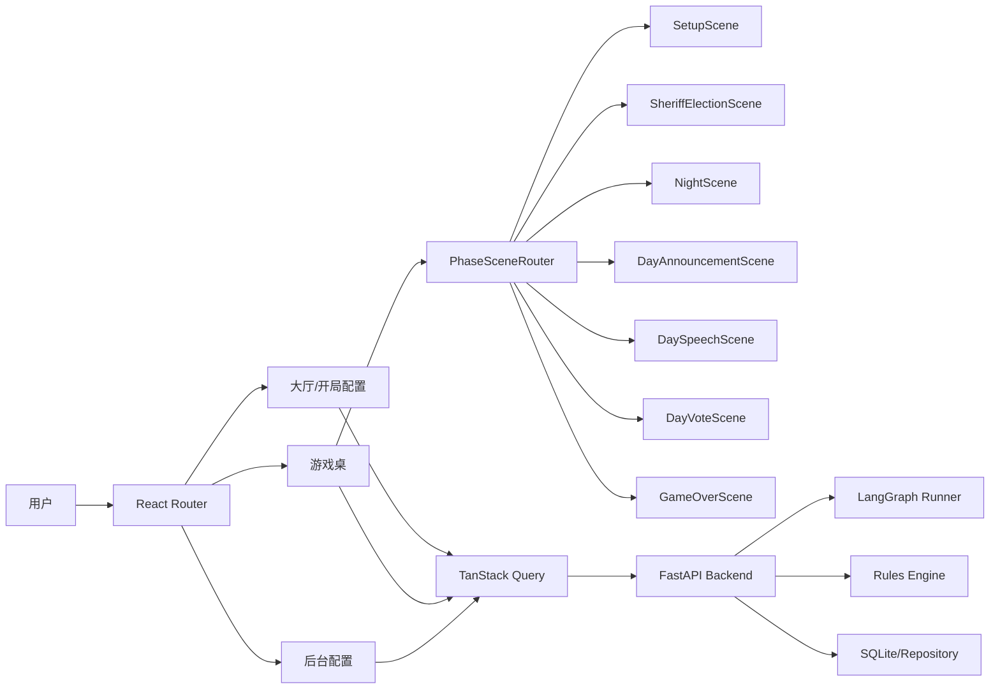
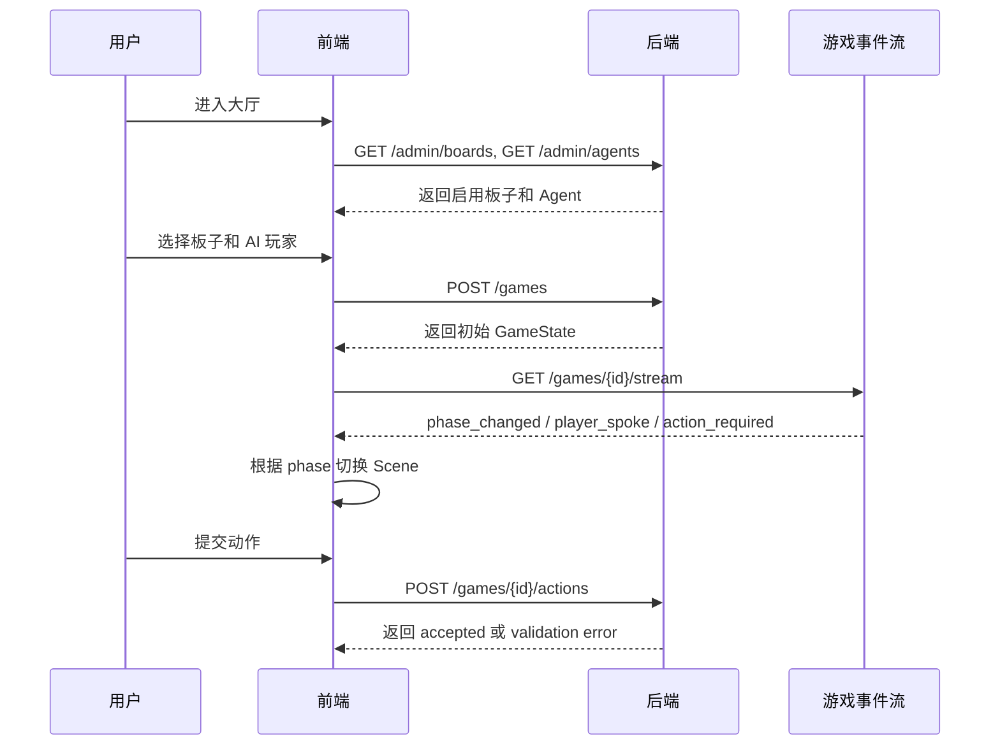

## 文档定位

本文是《AI狼人杀 PRD》的前端技术方案，目标是定义 MVP 到可玩版本的前端架构、页面拆分、阶段驱动场景切换、接口契约、状态管理与测试策略。

<callout emoji="🎯" background-color="light-blue">
核心原则：前端不负责推演狼人杀规则，只负责根据后端返回的 game_state.phase、可执行动作、事件时间线和玩家状态渲染对应场景，并把用户动作结构化提交给后端。
</callout>

## 1. 前端目标与边界

### 1.1 MVP 目标

- 用户可以选择后台已启用的板子和 AI Agent，创建一局游戏。
- 游戏桌面可以根据后端返回的游戏阶段自动切换场景。
- 用户可以看到座位、玩家头像、存活状态、警长标记、当前阶段、当天轮次和系统公告。
- 用户在轮到自己操作时，可以完成发言、投票、夜间技能等动作。
- 前端支持从游戏事件流恢复当前局面，刷新页面后不丢失游戏进度。
- 后台管理端可以维护板子和 AI Agent 人设，包括头像 URL 或头像生成提示词。

### 1.2 明确不做

- MVP 不做语音播报、实时语音房、多人联机匹配。
- MVP 不让玩家在前台自由自定义板子和 Agent 人设。
- MVP 不在前端暴露真实身份推理链、模型 Prompt、隐藏字段或内部角色分配逻辑。
- MVP 不由前端判断胜负、处理夜晚结算或投票平票规则。

## 2. 推荐技术栈

| 层级 | 推荐方案 | 说明 |
| --- | --- | --- |
| 构建框架 | React + Vite + TypeScript | MVP 启动快，适合和 FastAPI 后端分离部署 |
| 路由 | React Router | 管理大厅、开局配置、游戏桌、后台管理页面 |
| 服务端状态 | TanStack Query | 拉取板子、Agent、游戏状态、提交动作后的失效刷新 |
| 客户端状态 | Zustand | 保存当前选座、UI 展开态、临时发言草稿、动效偏好 |
| 样式 | Tailwind CSS + CSS Modules | 保持实现速度，同时让游戏桌局部样式可控 |
| 表单 | React Hook Form + Zod | 后台板子/Agent 编辑器需要强校验 |
| 实时更新 | SSE 优先，WebSocket 预留 | 单人对局以服务端推送事件为主，SSE 足够简单稳定 |
| 测试 | Vitest + Testing Library + Playwright | 单元、组件、端到端分别覆盖 |

<callout emoji="💡" background-color="light-yellow">
不建议 MVP 一开始使用过重的游戏引擎。狼人杀的核心体验是状态、发言与信息差，不是复杂物理或高帧率动画。React 足够承载第一版可玩体验。
</callout>

## 3. 前端整体架构



### 3.1 分层说明

- Pages：页面级容器，只负责路由、布局和组合业务模块。
- Features：按业务域拆分，如 game、lobby、admin-board、admin-agent。
- Components：可复用 UI，如 PlayerSeat、PhaseBanner、EventTimeline、ActionPanel。
- API Client：封装 HTTP/SSE 调用，不在组件里直接拼 URL。
- State：服务端权威状态放 TanStack Query，纯 UI 状态放 Zustand。

## 4. 页面与路由设计

| 路由 | 页面 | 主要职责 |
| --- | --- | --- |
| / | GameLobbyPage | 展示可用板子、可用 Agent、创建游戏入口 |
| /games/:gameId | GameTablePage | 游戏主界面，根据阶段切换场景 |
| /admin/boards | BoardListPage | 后台板子列表、启停、复制、创建入口 |
| /admin/boards/:boardId | BoardEditorPage | 编辑板子数据结构 |
| /admin/agents | AgentListPage | 后台 Agent 人设列表、头像状态 |
| /admin/agents/:agentId | AgentEditorPage | 编辑人设、发言风格、头像提示词 |

## 5. 游戏桌布局方案

游戏桌采用“三层结构”：

- 顶部：阶段横幅、天数、倒计时、胜负状态。
- 中部：座位环形或上下两排布局，展示玩家头像、昵称、存活、警长、发言中、已投票等状态。
- 底部：当前阶段主面板，展示公告、发言流、投票面板、夜间动作、等待状态。

移动端采用纵向布局：

- 顶部固定阶段条。
- 中部横向滑动玩家座位列表。
- 底部使用全屏抽屉承载动作区，避免按钮过小。

## 6. 阶段驱动场景切换

后端当前已有 GamePhase 枚举，前端以该字段作为唯一场景入口：

| 后端 phase | 前端 Scene | 用户看到的内容 | 用户可执行动作 |
| --- | --- | --- | --- |
| setup | SetupScene | 座位、身份分配等待、开局提示 | 通常无动作，等待进入首夜或警长竞选 |
| sheriff_election | SheriffElectionScene | 警长竞选状态、候选发言、投票入口 | 参选、退水、投票、跳过，具体以后端 allowed_actions 为准 |
| night | NightScene | 夜晚遮罩、当前需要用户执行的技能面板 | 狼人刀人、预言家查验、女巫用药等 |
| day_announcement | DayAnnouncementScene | 昨夜死亡信息、系统公告、遗言入口 | 确认继续、遗言发言 |
| day_speech | DaySpeechScene | 发言顺序、当前发言人、历史发言 | 用户轮次发言、跳过或提交文本 |
| day_vote | DayVoteScene | 可投票对象、投票进度、公开结果 | 投票、弃票、确认 |
| game_over | GameOverScene | 胜利阵营、复盘、玩家身份揭示 | 返回大厅、再开一局 |

### 6.1 PhaseSceneRouter 伪代码

```tsx
export function PhaseSceneRouter({ game }: { game: GameStateDto }) {
  switch (game.phase) {
    case "setup":
      return <SetupScene game={game} />;
    case "sheriff_election":
      return <SheriffElectionScene game={game} />;
    case "night":
      return <NightScene game={game} />;
    case "day_announcement":
      return <DayAnnouncementScene game={game} />;
    case "day_speech":
      return <DaySpeechScene game={game} />;
    case "day_vote":
      return <DayVoteScene game={game} />;
    case "game_over":
      return <GameOverScene game={game} />;
    default:
      return <UnsupportedPhaseScene phase={game.phase} />;
  }
}
```

### 6.2 场景切换规则

- 任何场景都不能假设下一个阶段固定，由后端返回的新状态决定。
- 用户提交动作后，前端立即禁用本轮动作按钮，展示“等待 AI 玩家行动”。
- 后端返回新事件时，先追加事件流，再刷新 game_state。
- 如果 phase 未变化但 current_turn_player_id 变化，前端只更新当前行动提示，不重新挂载整个游戏桌。
- 如果 phase 进入 game_over，前端停止 SSE 订阅或降级为低频轮询。

## 7. 前后端接口契约

### 7.1 当前后端已具备接口

| 方法 | 路径 | 用途 |
| --- | --- | --- |
| GET | /health | 健康检查 |
| GET | /admin/boards | 获取后台板子列表 |
| POST | /admin/boards | 创建后台板子 |
| GET | /admin/agents | 获取后台 Agent 列表 |
| POST | /admin/agents | 创建后台 Agent |
| POST | /games | 创建游戏 |

### 7.2 MVP 需要补齐的游戏接口

| 方法 | 路径 | 用途 | 前端依赖 |
| --- | --- | --- | --- |
| GET | /games/{game_id} | 获取当前 GameState | 页面刷新、断线恢复 |
| GET | /games/{game_id}/events | 获取事件时间线 | 首屏恢复事件流 |
| POST | /games/{game_id}/actions | 提交用户动作 | 发言、投票、夜间技能 |
| GET | /games/{game_id}/allowed-actions | 获取当前用户可执行动作 | 控制按钮展示与禁用 |
| GET | /games/{game_id}/stream | SSE 订阅游戏事件 | AI 行动、阶段推进、公告刷新 |

### 7.3 GameStateDto 建议结构

```ts
export type GamePhase =
  | "setup"
  | "sheriff_election"
  | "night"
  | "day_announcement"
  | "day_speech"
  | "day_vote"
  | "game_over";

export interface GameStateDto {
  game_id: string;
  board_id: string;
  phase: GamePhase;
  day_count: number;
  current_turn_player_id?: string | null;
  human_player_id: string;
  players: PlayerStateDto[];
  public_events: GameEventDto[];
  allowed_actions: PlayerActionOptionDto[];
  winner?: "werewolf" | "villager" | "third_party" | null;
}

export interface PlayerStateDto {
  player_id: string;
  agent_id?: string | null;
  seat: number;
  display_name: string;
  avatar_url?: string | null;
  alive: boolean;
  is_human: boolean;
  sheriff: boolean;
  speaking?: boolean;
  voted?: boolean;
}
```

### 7.4 PlayerActionDto 建议结构

```ts
export interface SubmitActionRequest {
  action_type:
    | "speech"
    | "vote"
    | "abstain"
    | "werewolf_kill"
    | "seer_check"
    | "witch_save"
    | "witch_poison"
    | "sheriff_run"
    | "sheriff_vote"
    | "skip";
  actor_player_id: string;
  target_player_id?: string | null;
  content?: string | null;
  client_action_id: string;
}
```

前端必须生成 client_action_id，用于防止用户重复点击导致重复提交。

## 8. 前端状态管理

### 8.1 服务端状态

TanStack Query 管理：

- boards：后台可用板子。
- agents：后台可用 Agent。
- gameState：当前游戏权威状态。
- gameEvents：事件时间线。
- allowedActions：当前用户动作集合。

缓存策略：

- boards/agents：60 秒内视为新鲜。
- gameState：进入游戏桌后由 SSE 驱动刷新，不依赖长缓存。
- action mutation 成功后立即 invalidate gameState、events、allowedActions。

### 8.2 客户端 UI 状态

Zustand 管理：

- 当前选中的 board_id、agent_ids。
- 游戏桌视角：座位布局模式、事件面板展开状态。
- 发言草稿：按 game_id + phase + day_count 保存。
- 用户设置：减少动画、暗色模式、自动滚动事件流。

## 9. 关键组件拆分

| 组件 | 职责 |
| --- | --- |
| GameTableShell | 游戏桌整体布局，承载顶部、中部、底部区域 |
| PhaseBanner | 展示 phase、day_count、倒计时、等待状态 |
| PlayerSeat | 展示头像、昵称、座位号、存活、警长、发言中 |
| SeatRing | 根据玩家数量渲染座位布局 |
| EventTimeline | 展示公开事件、系统公告、发言摘要 |
| ActionPanel | 根据 allowed_actions 分发具体动作表单 |
| SpeechComposer | 用户发言输入、字数限制、提交 |
| VotePanel | 可投票对象列表、确认投票、弃票 |
| NightActionPanel | 夜间技能动作入口 |
| GameResultPanel | 胜负结果、身份复盘、再开一局 |

## 10. 后台配置前端

### 10.1 板子编辑器

字段来自现有 frontend-contracts/board-editor.md：

- board_id、name、roles、sheriff_enabled、speech_rule、vote_rule、win_condition、enabled。
- roles 使用可增删表格，每行包含 role_key、count、min_count、max_count。
- 保存前前端做基础校验，最终以后端 BoardValidator 为准。

板子编辑器的关键交互：

- “启用/停用”不删除数据。
- “复制为新板子”方便运营快速扩展新玩法。
- 显示总人数、狼人数量、神职数量、村民数量的实时统计。
- 校验失败时定位到具体字段，不只显示一条通用错误。

### 10.2 Agent 人设编辑器

字段来自现有 frontend-contracts/agent-editor.md：

- agent_id、name、persona、speech_style、reasoning_level、deception_level、aggression_level、cooperation_level、risk_preference、memory_style、enabled。
- avatar_url、avatar_prompt 为可选。

Agent 编辑器的关键交互：

- 数值型人格特征使用 1-5 档滑杆。
- risk_preference 使用单选控件。
- avatar_prompt 支持保存草稿，头像生成失败时显示默认头像。
- 列表页按启用状态、风险偏好、欺骗等级筛选。

## 11. 用户主流程



## 12. 错误处理与降级

| 场景 | 前端处理 |
| --- | --- |
| 创建游戏失败 | 保留用户选择，展示具体错误，如 Agent 数量不匹配 |
| SSE 断开 | 自动重连 3 次，失败后降级为 3 秒轮询 |
| 动作重复提交 | 通过 pending 状态和 client_action_id 防重 |
| allowed_actions 为空 | 展示等待态，不显示可点击动作 |
| 后端返回未知 phase | 展示 UnsupportedPhaseScene，并上报错误 |
| 头像加载失败 | 使用默认头像或角色色块 |
| 刷新页面 | 通过 GET /games/{game_id} 和 events 恢复 |

## 13. 权限与信息安全

- 前端只展示公开信息和用户自己允许看到的信息。
- 不展示其他玩家 role_key，直到 game_over 或后端明确公开。
- 不把 Prompt、模型参数、隐藏推理链放入前端响应。
- 管理端与游戏端路由分离，后续接入登录后对 /admin/* 做权限拦截。
- 事件流必须区分 public_events 与 private_events，用户只能收到自己的私密技能结果。

## 14. 测试策略

### 14.1 单元测试

- phaseToScene 映射完整性：所有 GamePhase 都有对应 Scene。
- allowed_actions 到 ActionPanel 的映射。
- GameStateDto 类型解析与异常兼容。
- 发言草稿 key 生成逻辑。

### 14.2 组件测试

- PlayerSeat 渲染存活、死亡、警长、发言中状态。
- VotePanel 只允许选择 alive 且可投票玩家。
- NightActionPanel 根据 action_type 渲染不同技能表单。
- EventTimeline 自动滚动与手动暂停。

### 14.3 E2E 测试

- 从大厅选择 6 人新手局并成功开局。
- phase 从 setup 变为 night 时，游戏桌切换到夜晚场景。
- 用户在 day_vote 阶段提交投票后按钮禁用并展示等待状态。
- game_over 后展示胜利阵营和复盘入口。

## 15. 里程碑计划

| 阶段 | 目标 | 验收标准 |
| --- | --- | --- |
| M1 前端骨架 | 初始化 React/Vite/TS、路由、API Client | 可访问大厅、后台、游戏桌空页面 |
| M2 配置读取 | 接入 boards/agents 列表和开局表单 | 可选择板子与 Agent 并 POST /games |
| M3 游戏桌 | 实现 GameTableShell、PlayerSeat、PhaseBanner | 能渲染后端返回的初始 GameState |
| M4 阶段场景 | 实现 PhaseSceneRouter 和 7 个 Scene | 修改 phase mock 后场景正确切换 |
| M5 动作提交 | 接入 allowed_actions 和 submit action | 用户可发言、投票、夜间选择目标 |
| M6 实时刷新 | 接入 SSE 和断线降级轮询 | AI 行动后前端自动更新 |
| M7 后台编辑器 | 实现板子和 Agent 编辑页 | 可创建、校验、启停配置 |
| M8 MVP 验收 | 完成 6 人新手局端到端流程 | 单人可完整跑完一局并看到结果 |

## 16. 与后端开发的接口对齐清单

- 后端需要将 game_id 从 game_pending 改为真实唯一 ID。
- 后端需要新增 GET /games/{game_id}。
- 后端需要新增 POST /games/{game_id}/actions。
- 后端需要新增 allowed_actions 字段或接口。
- 后端需要区分 public_events 与 private_events。
- 后端需要为 PlayerState 补充 display_name、avatar_url、speaking、voted 等前端展示字段。
- 后端需要提供事件类型枚举，保证前端 EventTimeline 可稳定渲染。
- 后端需要明确 SSE 事件格式：event_id、event_type、game_id、payload、created_at。

## 17. 推荐目录结构

```text
frontend/
  src/
    app/
      router.tsx
      query-client.ts
    api/
      client.ts
      games.ts
      boards.ts
      agents.ts
      sse.ts
    features/
      lobby/
      game/
        components/
        scenes/
        hooks/
        types.ts
      admin-board/
      admin-agent/
    shared/
      components/
      store/
      utils/
    tests/
```

## 18. 结论

前端第一版应围绕“后端权威状态 + phase 场景路由 + allowed_actions 动作面板”实现。这样可以避免前端重复实现规则引擎，也能让后续新增板子、角色、警长规则、AI 人设时保持扩展性。

MVP 的关键不是一次性做复杂动效，而是把状态流跑通：开局、阶段切换、用户行动、AI 行动、事件刷新、胜负复盘。只要这个闭环稳定，后续再增加语音播报、动画演出、头像生成和更强的观战复盘都会更自然。
