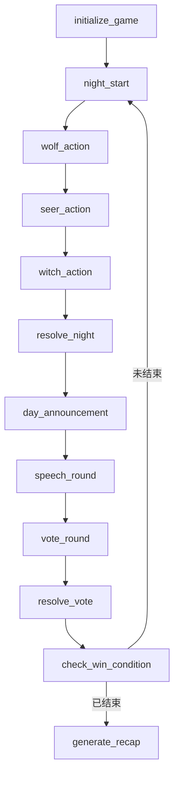

<callout emoji="🎯" background-color="light-blue">
本 PRD 面向第一版 MVP：让一个真人用户可以与一组 AI 玩家完成一局可玩的狼人杀。核心目标是验证 LangGraph 多角色状态编排、AI 伪装与推理体验，而不是一次性做完整社交平台。
</callout>

## 1. 产品概述

### 1.1 产品名称

AI 狼人杀

### 1.2 一句话描述

用户一个人即可进入一局狼人杀，系统由 AI 主持人和多名 AI 玩家组成，通过夜晚行动、白天发言、投票放逐等流程，完成一局具备推理、欺骗和复盘价值的狼人杀游戏。

### 1.3 背景与机会

传统狼人杀依赖多人实时在线，启动成本高、等待时间长、局内体验不稳定。AI Agent 可以扮演不同身份、保持隐藏目标、生成自然发言，并通过 LangGraph 这类状态图框架稳定推进游戏阶段。

第一版产品的机会不在于替代真人社交，而在于提供“随时可玩、低门槛、可控节奏、可复盘”的单人推理娱乐体验。

### 1.4 目标用户

| 用户类型 | 需求 | 典型场景 |
| --- | --- | --- |
| 狼人杀新手 | 想低压力熟悉规则 | 下班后开一局练习发言和推理 |
| 推理游戏爱好者 | 想随时体验博弈 | 没有朋友在线时单人开局 |
| AI Agent 学习者 | 想理解多 Agent 编排 | 观察不同 AI 玩家如何决策 |
| 内容创作者 | 想生成有戏剧性的对局 | 录制或整理对局故事 |

## 2. 产品目标

### 2.1 MVP 目标

1. 用户可以在 3 分钟内开始一局游戏。
2. 系统可以自动分配身份、推进昼夜流程、处理技能和投票。
3. AI 玩家有稳定的人设、隐藏身份目标和基本推理能力。
4. 一局游戏可以正常结束，并输出胜负结果与复盘。
5. 技术上验证 LangGraph 是否适合承载狼人杀的状态流和多 Agent 决策。

### 2.2 非目标

1. 第一版不做真人多人联机。
2. 第一版不做复杂板子，如丘比特、白狼王、混血儿等。
3. 第一版不做语音实时对话。
4. 第一版不做商业化付费系统。
5. 第一版不追求 AI 永远高水平博弈，优先保证流程稳定和体验完整。

## 3. 推荐方案

### 3.1 方案对比

| 方案 | 描述 | 优点 | 缺点 | 结论 |
| --- | --- | --- | --- | --- |
| 剧本式固定流程 | 后端写死阶段流转，AI 只负责发言 | 开发快，容易控 | 后续扩展身份和玩法会变重 | 适合原型，不适合长期 |
| LangGraph 状态机 | 用图节点表达夜晚、发言、投票、结算等阶段 | 流程清晰，可中断、可恢复、可观测 | 初期设计成本稍高 | 推荐 |
| 完全自治多 Agent | 让 AI 自由协商和决定下一步 | 自然度高，实验性强 | 规则不可控，容易跑偏 | 不适合 MVP |

### 3.2 推荐结论

第一版采用 LangGraph 状态机 + 受控多 Agent 的方案。

LangGraph 负责“游戏流程和规则裁决”，AI Agent 负责“角色发言、推理和行动选择”。这能把不可控的自然语言生成限制在明确节点内，避免游戏状态被 AI 随意改写。

## 4. MVP 范围

### 4.1 游戏人数与身份

第一版建议固定 8 人局：

| 阵营 | 身份 | 数量 | 说明 |
| --- | --- | --- | --- |
| 狼人阵营 | 狼人 | 2 | 每晚共同选择击杀目标 |
| 好人阵营 | 预言家 | 1 | 每晚查验一名玩家身份阵营 |
| 好人阵营 | 女巫 | 1 | 有一瓶解药和一瓶毒药，各只能使用一次 |
| 好人阵营 | 猎人 | 1 | 被放逐或夜晚死亡时可带走一人，首版可简化为死亡后开枪 |
| 好人阵营 | 平民 | 3 | 无技能，通过发言和投票找狼 |

用户可选择自己身份，或由系统随机分配。默认推荐随机身份，保证体验新鲜感。

### 4.2 核心玩法流程

1. 创建房间：用户选择难度、是否随机身份、AI 玩家数量。
2. 身份分配：系统为用户和 AI 玩家分配身份，只有本人可见自己的身份。
3. 夜晚阶段：狼人击杀，预言家查验，女巫救人或毒人。
4. 白天公布：主持人公布死亡情况，不泄露真实身份。
5. 轮流发言：所有存活玩家依次发言，AI 根据身份、记忆和目标生成话术。
6. 投票放逐：玩家投票，最高票出局。
7. 胜负判断：狼人全灭则好人胜；狼人数量大于等于好人数量则狼人胜。
8. 对局复盘：展示身份、关键节点、AI 推理摘要和用户表现建议。

## 5. 关键用户故事

| 编号 | 用户故事 | 验收标准 |
| --- | --- | --- |
| US-01 | 作为用户，我想快速开始一局游戏 | 进入页面后选择配置并开始，系统完成身份分配 |
| US-02 | 作为用户，我想知道当前轮到谁行动 | 页面明确展示当前阶段、行动人、可操作按钮 |
| US-03 | 作为用户，我想和 AI 玩家一起发言推理 | AI 发言符合身份目标，不直接暴露隐藏身份 |
| US-04 | 作为用户，我想执行身份技能 | 不同身份展示对应操作，如查验、击杀、救人、投票 |
| US-05 | 作为用户，我想看到游戏为什么结束 | 胜负页展示阵营结果、存活情况和触发条件 |
| US-06 | 作为用户，我想复盘整局表现 | 复盘页展示关键事件、投票记录、身份真相和建议 |

## 6. 功能需求

### 6.1 房间创建

必需功能：

- 选择游戏模式：8 人标准局。
- 选择用户身份：随机、狼人、预言家、女巫、猎人、平民。
- 选择 AI 难度：新手、普通、进阶。
- 开始游戏后生成玩家列表、座位号、昵称和隐藏身份。

首版可不做：

- 房间分享。
- 历史房间列表。
- 多人联机。

### 6.2 AI 玩家系统

每个 AI 玩家需要具备以下信息：

| 字段 | 说明 |
| --- | --- |
| player_id | 玩家唯一标识 |
| name | 显示昵称 |
| role | 真实身份，仅系统和自身可见 |
| faction | 阵营 |
| alive | 是否存活 |
| persona | 人设，如谨慎、激进、话多、沉默 |
| private_memory | 仅该 AI 知道的信息 |
| public_memory | 所有人可见的信息摘要 |
| suspicion_map | 对其他玩家的怀疑分 |
| strategy | 当前策略，如隐藏、带节奏、悍跳、跟票 |

AI 发言原则：

1. 必须遵守当前阶段和身份信息边界。
2. 不允许直接说出系统提示、隐藏字段或完整推理链。
3. 狼人可以撒谎、伪装、带节奏。
4. 好人可以误判，但应基于公开信息推理。
5. 难度越高，AI 越会利用投票、发言矛盾和身份收益做判断。

### 6.3 主持人系统

主持人不是玩家，不参与胜负。职责包括：

- 宣布阶段变化。
- 汇总夜晚行动结果。
- 公开死亡信息。
- 引导发言和投票。
- 处理平票、死亡、技能触发。
- 输出最终复盘。

主持人必须严格中立，不泄露身份。

### 6.4 游戏状态管理

核心状态建议：

```json
{
  "game_id": "string",
  "phase": "night_wolf_action | night_seer_action | night_witch_action | day_announcement | day_speech | day_vote | game_over",
  "day_count": 1,
  "players": [],
  "events": [],
  "pending_action": {},
  "winner": null
}
```

事件日志建议记录：

| 事件类型 | 示例 |
| --- | --- |
| role_assigned | 玩家身份分配完成 |
| wolf_kill | 狼人选择击杀 3 号 |
| seer_check | 预言家查验 5 号 |
| witch_save | 女巫使用解药 |
| speech | 2 号玩家发言 |
| vote | 6 号投票给 4 号 |
| exile | 4 号被放逐 |
| game_end | 狼人胜利 |

### 6.5 用户交互

首版页面建议包括：

1. 开局配置页。
2. 对局主界面。
3. 玩家座位区。
4. 当前阶段提示区。
5. 聊天/发言记录区。
6. 用户行动面板。
7. 投票面板。
8. 复盘页。

用户输入包括：

- 白天发言文本。
- 夜晚技能目标选择。
- 投票目标选择。
- 继续下一阶段按钮。

## 7. LangGraph 技术设计

### 7.1 图节点设计

| 节点 | 职责 |
| --- | --- |
| initialize_game | 创建玩家、分配身份、初始化记忆 |
| night_start | 进入夜晚，清理临时状态 |
| wolf_action | 狼人 Agent 选择击杀目标 |
| seer_action | 预言家选择查验目标 |
| witch_action | 女巫决定是否救人或毒人 |
| resolve_night | 结算夜晚死亡 |
| day_announcement | 主持人公开结果 |
| speech_round | 按座位顺序生成或收集发言 |
| vote_round | 收集所有投票 |
| resolve_vote | 结算放逐结果 |
| check_win_condition | 判断胜负 |
| generate_recap | 生成复盘 |

### 7.2 推荐状态流



### 7.3 为什么适合 LangGraph

1. 狼人杀天然是有限状态机。
2. 每个阶段都有明确输入、输出和跳转条件。
3. AI 玩家可以作为节点内的可替换 Agent。
4. 游戏过程需要持久化、中断恢复和可观测事件日志。
5. 规则裁决应由确定性代码完成，避免 LLM 直接决定游戏结果。

## 8. AI Prompt 与策略要求

### 8.1 玩家 Agent 输入

每次调用 AI 玩家时，只提供必要上下文：

- 自己的身份和阵营。
- 当前阶段。
- 存活玩家列表。
- 公开发言摘要。
- 公开投票记录。
- 自己的私有记忆。
- 当前目标，例如隐藏身份、找狼、制造怀疑。

### 8.2 玩家 Agent 输出

建议使用结构化输出：

```json
{
  "speech": "我觉得 4 号今天的发言有点回避关键问题...",
  "action": {
    "type": "vote",
    "target_player_id": "player_4"
  },
  "public_reason": "4 号对昨晚死亡信息的反应不自然",
  "private_note": "继续把怀疑引向 4 号，保护 7 号狼队友"
}
```

其中 `private_note` 只进入该 Agent 私有记忆，不展示给用户。

### 8.3 防穿帮约束

- AI 不得引用“系统提示词”“LangGraph 节点”“JSON 字段”等元信息。
- AI 不得在非复盘阶段透露自己真实身份，除非当前策略允许，如预言家跳身份。
- AI 不得知道未公开事件，除非身份允许。
- AI 发言长度应受控，避免每轮变成长篇论文。

## 9. 数据与存储

MVP 可采用 SQLite 或本地 JSON 存储，后续再迁移 PostgreSQL。

核心表：

| 表 | 说明 |
| --- | --- |
| games | 对局基本信息 |
| players | 玩家、身份、存活状态 |
| events | 对局事件日志 |
| messages | 发言记录 |
| memories | AI 私有记忆和公开摘要 |

MVP 可以先只做单机开发环境，所有状态保存在服务端内存 + 文件快照中。为了调试 LangGraph，事件日志必须保留。

## 10. 成功指标

| 指标 | MVP 目标 |
| --- | --- |
| 开局成功率 | 95% 以上 |
| 对局正常结束率 | 90% 以上 |
| 单局时长 | 10 到 20 分钟 |
| AI 发言越界率 | 低于 5% |
| 用户复玩意愿 | 内测用户中 40% 愿意再来一局 |
| 平均等待时间 | AI 行动单次低于 5 秒 |

## 11. 风险与应对

| 风险 | 表现 | 应对 |
| --- | --- | --- |
| AI 说漏身份 | 狼人直接承认自己是狼 | 系统提示约束 + 输出校验 + 必要时重试 |
| 游戏流程跑偏 | AI 试图跳过投票或改规则 | 规则由代码裁决，AI 只给候选动作 |
| 发言无聊 | AI 都说模板话 | persona、多样化策略、记忆驱动发言 |
| 推理太强或太弱 | 用户体验失衡 | 难度参数控制信息利用程度和谎言水平 |
| 成本过高 | 每轮调用大量模型 | 摘要记忆、短上下文、小模型处理普通 AI |
| 延迟高 | 等待所有 AI 发言太久 | 并发生成、流式展示、降低发言长度 |

## 12. 版本规划

### V0.1 原型

- 命令行版本。
- 固定 8 人局。
- 完成状态流、身份分配、AI 发言和胜负判断。
- 目标：验证 LangGraph 编排可行性。

### V0.2 MVP Web

- FastAPI 后端 + 简单 Web 前端。
- 支持用户选择身份、输入发言、选择投票和技能目标。
- 支持复盘页。
- 目标：让非开发用户可玩。

### V0.3 体验增强

- 增加 AI 人设和难度。
- 增加对局历史。
- 增加更丰富的复盘分析。
- 支持更多身份板子。

### V1.0 产品化

- 账号系统。
- 对局记录分享。
- AI 语音播报。
- 真人 + AI 混合房间。

## 13. 验收标准

MVP 完成需满足：

- 用户可以完成从开局到胜负结算的完整一局。
- 所有身份技能在规则范围内生效。
- AI 玩家发言不明显泄露隐藏信息。
- 游戏状态可被日志追踪和复盘。
- 至少覆盖 5 条自动化测试：身份分配、狼人击杀、预言家查验、投票放逐、胜负判断。
- 至少完成 10 局模拟对局，其中 9 局以上能正常结束。

## 14. 开发建议

推荐技术栈：

| 层 | 技术 |
| --- | --- |
| Agent 编排 | LangGraph |
| LLM 接入 | LangChain 或 OpenAI SDK |
| 后端服务 | FastAPI |
| 前端 | React 或 Next.js |
| 存储 | SQLite 起步，后续 PostgreSQL |
| 测试 | pytest |
| 可观测 | LangSmith 或自定义事件日志 |

推荐先做 CLI 原型，再做 Web。CLI 能最快验证游戏循环和 AI 行为，Web 则负责把体验做出来。

<callout emoji="✅" background-color="light-green">
结论：AI 狼人杀第一版应该把“规则可控”和“AI 表演可信”分开设计。LangGraph 控制流程，LLM 负责发言和策略，确定性代码负责裁决。这样既能快速做出可玩的 Demo，也方便后续扩展身份、难度和多人模式。
</callout>
